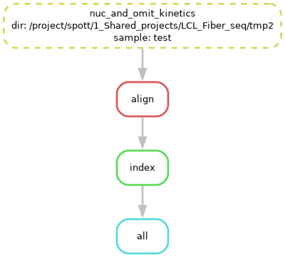
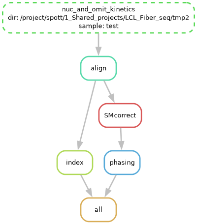
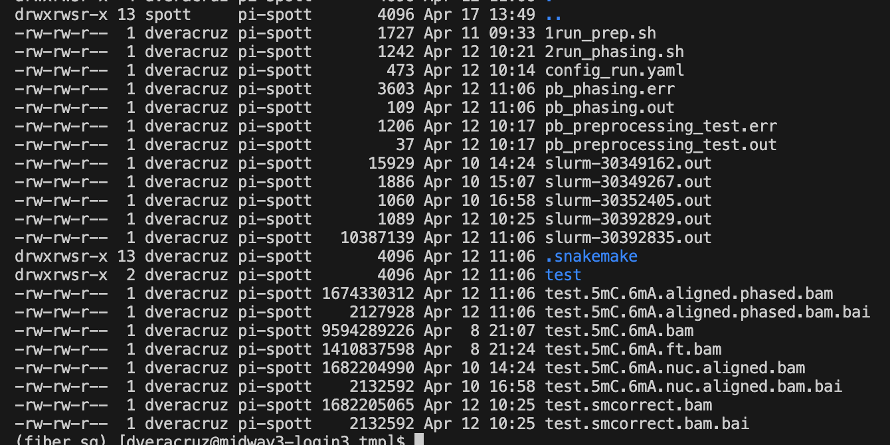

## Goals

This pipeline is designed to pre-process PacBio sequencing data. The input data are HiFi BAM files with full kinetic data. 
This script was written and set up for Snakemake V7

## Latest Pipeline: `pb_complete.smk`

New chemistry, input BAM contains 5mC and 6mA tags already -> Aligned, 5mC, 6mA, nucleosomes +(phased) BAM

1. **Add nucleosomes and remove kinetics tags**: In older chemistry, this happens in the `predict-m6a` step, for this newer chemistry, this is done with `ft add-nucleosomes | ft clear-kinetics`.

2. **Align to reference genome**: The pipeline uses `pbmm2` to align the reads to the reference genome.

3. **Phasing (OPTIONAL)** Uses Hiphase to phase aligned reads, it uses a reference VCF for this. 


## Other pipelines 

### `pb_preprocessing.smk`

**Older chemistry, BAM with kinetics -> Aligned BAM**

An older version of the pipeline can also process PacBio sequencing data to produce 5mC and 6mA tags, and do preprocessing only. The snakemake file for this is in `workflow/pb_preprocessing.smk`

1. **Obtain 5mC and 6mA tags (Optional, for older chemistry)**: It uses `jasmine` for 5mC and `ft predict-m6a` for 6mA prediction. 

2. **Align to reference genome**: The pipeline uses `pbmm2` to align the reads to the reference genome.

This pipeline only needs two parameters, **samples** and **out_dir** defined in the `config.yaml` file, in similar format as defined below for the latest version.

    - samples: Dictionary with sample names and paths to raw bam files.
    - out_dir: Full path of output directory.
    

### `pb_preprocessing_v2.smk`

** New chemistry, input BAM contains 5mC and 6mA tags -> Aligned, nucleosomes BAM**

1. **Add nucleosomes and remove kinetics tags**: In older chemistry, this happens in the `predict-m6a` step, for this newer chemistry, this is done with `ft add-nucleosomes | ft clear-kinetics`.

2. **Align to reference genome**: The pipeline uses `pbmm2` to align the reads to the reference genome.


### `pb_phasing.smk`

**Phasing only, aligned BAM -> Phased BAM**

1. **Phasing** Uses `Hiphase` to phase aligned reads, it uses a reference VCF for this. 

This pipeline is in `workflow/pb_phasing.smk` and uses a `config.yaml` file similar as the one for the latest pipeline. 

This pipeline can easily be modified to use `WhatsHap` for Nanopore data, since Hiphase is for PacBio data only. 


```{r setup, include=FALSE}
knitr::opts_chunk$set(echo = TRUE)
```

## Pipeline structure

Depending on whether you need phasing, the pipeline will look like: 

### Pre-processing only




### Pre-processing + phasing



## Run pre-processing pipeline. 

### 1. Make or define the output file for the pipeline. Set it up as working directory. 
  
```{bash, eval = F}
out_dir="/project/spott/1_Shared_projects/LCL_Fiber_seq/tmp2"

mkdir -p $out_dir ## Create the directory if it does not exists, no error if it does.

cd $out_dir ## Change to the output directory. 
```
  
### 2. Copy example of config.yaml and run_preprocessing.sh to output file. 
  
```{bash, eval =F}
smk_dir="/project/spott/dveracruz/pacbio_preprocessing"

## Copy the bash script to submit the job. 
cp $smk_dir/run_preprocessing.sh .

## Copy a reference config file, modify it to your needs -> 
cp $smk_dir/workflow/config_run_complete.yaml ./config_run.yaml

## Optional: Copy the smk file if you want a copy of the original code used. 
cp $smk_dir/workflow/pb_complete.smk ./pb_complete.smk

```

### 3. Edit the config.yaml file to your needs.

In the output directory, make sure you have a file named `config_run.yaml`. If a different name is desired, change the *_configfile_* variable in the `run_preprocessing.sh` file. Make sure it matches. 

The *_vcf_* and *_vcf_sm_* arguments are only used if **phasing** is set to Yes (lower or upper case). But can be present even if phasing is set to No. 

The pipeline checks the validity of the arguments, making sure the directories or files exists and that the *_vcf_sm_* and *_samples_* directories have matching names. 

  - *out_dir* Full path of output directory. 
  
  - *high_cov* Set to "Yes" if the sample is high coverage, otherwise set to "No", default. This will change the resources used for the alignment step.
  
  -*samples* A dictionary with the sample names and their corresponding BAM files. The keys are the sample names, and the values are the full paths to the BAM files. The sample names should be unique.
  
  - *phasing* Set to "Yes" if you want to use a VCF file for phasing. This will change the resources used for the alignment step.
  
  - *vcf* Full path to the VCF file to use for phasing. This is only used if phasing is set to "Yes". This can be a vcf with 1 or multiple samples, just make sure the SM you select for your samples are present in that VCF. 
  
  - *vcf_sm* A dictionary with the sample names in the VCF file. The keys are the sample names in the config.yaml file, and the values are the sample names in the VCF file. This is only used if phasing is set to "Yes".
  

#### Pre-processing only
```{bash, eval = F}
## Config YAML file for pacbio-preprocessing pipeline

out_dir: "/project/spott/1_Shared_projects/LCL_Fiber_seq/tmp2"

## Size of samples: high coverage? or not. If missing, default is to "no" 
high_cov: "No"

## Phasing: Only use this if you have a close sample VCF for phasing. Since we are not calling variants. 
phasing: "No"

samples:
   test: "/project/spott/1_Shared_projects/LCL_Fiber_seq/Data/test.bam"
```

#### Pre-processing + phasing
```{bash, eval = F}
## Config YAML file for pacbio-preprocessing pipeline

out_dir: "/project/spott/1_Shared_projects/LCL_Fiber_seq/tmp2"

## Size of samples: high coverage? or not.
high_cov: "No"

## Phasing: Only use this if you have a close sample VCF for phasing. Since we are not calling variants. 
phasing: "Yes"

vcf: "/project/spott/reference/YRI_genotypes/human.YRI.hg38.all.AF.gencode.vcf.gz" ## LCLs VCF from Gilad lab.

samples:
   test: "/project/spott/1_Shared_projects/LCL_Fiber_seq/Data/test.bam"

vcf_sm:
  test: "NA19099"

```

#### Auxiliar: Generate samples table

To get some help creating the samples section for the yaml, you can use the following command. 

The result of the section will be a section of the config.yaml variables including all the samples from the bam_dir folder (Given a folder, it will list all the bam files, and use as sample name the preffix of the file)

You can copy this and modify it for your own samples

```{bash, eval = F}
source activate /project/spott/dveracruz/bin/miniconda3/envs/fiber_sq

bam_dir='path/to/input/bam'
Rscript /project/spott/dveracruz/pacbio_preprocessing/generate_config_run.r  bam_dir '.' 'Yes' 

```


### 4. Run the pipeline

Once you have the config_run yaml, and the run_preprocessing.sh file, you can run the pipeline.

While running, this will first create a DAG png file with the visual version of your samples, and also create a log file with the output of the snakemake command, along with individual logs per job submitted. 

The pipeline already has defined resources for each step, including partition, number of threads and memory. 
The high_cov variable will change the resources for the alignment step, which is the most demanding, using more resources and the bigmem partition if set to yes, and lower memory and threads, and caslake partition otherwise, which is the default if the variable is not set in the config file.


```{bash, eval = F}
# cd $out_dir ## Change to the output directory.

## Submit job.
sbatch run_preprocessing.sh
```


## Output data

For each sample, the output directory will contain multiple BAM versions, the important ones are those ending with
*5mC.6mA.nuc.aligned.bam* and *5mC.6mA.aligned.phased.bam* if phasing was done. 




